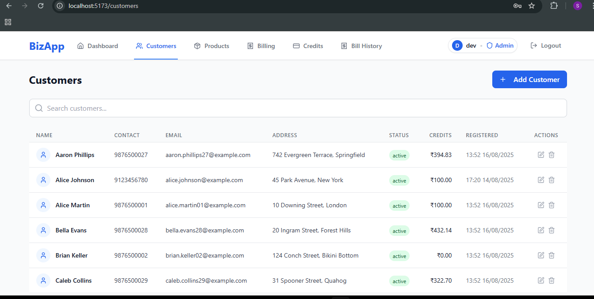

# BizNex - Business Management System

A comprehensive business management application designed to streamline operations for small and medium-sized enterprises. Built with Spring Boot backend and React frontend, BizNex provides a complete solution for managing customers, inventory, billing, and financial operations.

## 📸 Screenshots

### Dashboard

#### Admin Dashboard


#### User Dashboard


### Customer Management




### Product Inventory


### Billing System


### Credits Management


### Bill History


### Admin Page (Only admin has access | for managing users)


## ✨ Features

### 🔐 Authentication & Authorization

- **JWT-based Authentication**: Secure login with access and refresh tokens
- **Role-based Access Control**: Admin and User roles with different permissions
- **Password Security**: BCrypt encryption with strong password policies
- **Session Management**: Automatic token refresh and secure logout

### 👥 Customer Management

- **Complete CRUD Operations**: Add, view, edit, and delete customers
- **Advanced Search**: Search by name, contact, or email with pagination
- **Credit Tracking**: Monitor customer credits and payment history
- **Contact Validation**: 10-digit phone number validation
- **Status Management**: Active/inactive customer status tracking

### 📦 Product Inventory

- **Inventory Control**: Track product quantities with low-stock alerts
- **Category Management**: Organize products by categories
- **Auto-generated Codes**: Automatic product code generation
- **Price Management**: Set and update product prices
- **Search & Filter**: Find products by name, code, or category
- **Stock Prioritization**: Low-stock items displayed first

### 🧾 Billing System

- **Multi-item Bills**: Create bills with multiple products
- **Payment Methods**: Support for cash, card, online, and credit payments
- **Return Processing**: Handle partial and full returns
- **Bill Types**: New sales, returns, and credit payments
- **Real-time Calculations**: Automatic total and discount calculations
- **Stock Updates**: Automatic inventory updates on bill creation

### 💳 Credits Management

- **Credit Tracking**: Monitor customer outstanding credits
- **Payment Processing**: Process credit payments with bill generation
- **Aggregate Analytics**: Total and average credits across customers
- **Search Functionality**: Find customers with credits
- **Payment Methods**: Multiple payment options for credit settlements

### 📊 Reporting & Analytics (Only visible to Admin)

- **Dashboard Metrics**: Key business indicators and statistics
- **Revenue Tracking**: 7-day revenue trends with visual charts
- **Category Analytics**: Product distribution by category
- **Recent Transactions**: Latest bill activity overview
- **Low Stock Alerts**: Identify products needing restocking

### 🔍 Advanced Search & Filtering

- **Global Search**: Search across bills, customers, and products
- **Pagination**: Efficient handling of large datasets
- **Sorting Options**: Multiple sorting criteria for all entities
- **Filter Combinations**: Combine multiple filters for precise results

## 🛠 Tech Stack

### Backend

- **Framework**: Spring Boot 4.0.0-M1
- **Security**: Spring Security with JWT
- **Database**: MySQL with JPA/Hibernate
- **Validation**: Bean Validation (JSR-303)
- **Mapping**: MapStruct for DTO conversions
- **Documentation**: OpenAPI 3 (Swagger)
- **Build Tool**: Maven

### Frontend

- **Framework**: React 19.1.1
- **Build Tool**: Vite
- **Styling**: Tailwind CSS
- **HTTP Client**: Axios with OpenAPI generated client
- **Routing**: React Router DOM
- **Icons**: Lucide React
- **State Management**: React Context API

### Development Tools

- **Code Quality**: ESLint
- **Version Control**: Git
- **API Documentation**: Swagger UI
- **Testing**: Spring Boot Test, JUnit

## 🚀 Getting Started

### Prerequisites

- Java 17 or higher
- Node.js 18+ and npm
- MySQL 8.0+
- Maven 3.6+

### Backend Setup

#### First login (bootstrap admin) — instructions and rationale

- Before starting the application, set the bootstrap admin values as environment variables or in `application.properties`:
  - `APP_BOOTSTRAP_ADMIN_USER` (default: `admin`)
  - `APP_BOOTSTRAP_ADMIN_PASSWORD` (REQUIRED — choose a strong secret)
  - `APP_BOOTSTRAP_ADMIN_EMAIL` (optional, default like `user@example.com`)
  - `APP_BOOTSTRAP_ADMIN_CONTACT` (optional phone number)
- Start the backend so the bootstrap routine can create the initial admin account:
  - `./mvnw spring-boot:run`
- Perform initial login:
  - Open the frontend at `http://localhost:5173` (or call `POST /api/v1/auth/login`) and use the bootstrap admin credentials.
- Immediately after first login:
  - Change the admin password to a unique, strong password via the user settings or `PATCH /api/v1/auth/first-login/password`.
  - Create additional user accounts (Admin and User roles) as needed.
  - Revoke or remove the bootstrap credentials from config or disable bootstrap logic in production.
- Secure the environment:
  - Rotate `JWT_SECRET` to a strong base64-encoded value if not already set.
  - Store credentials and secrets in a secure vault or environment (do not commit to source control).

1. **Clone the repository**

   ```bash
   git clone <repository-url>
   cd BizNex
   ```

2. **Configure Database**

   Create a MySQL database and update `src/main/resources/application.properties`:

   ```properties
   # Set these as environment variables for security
   DB_URL=jdbc:mysql://localhost:3306/biznex_db
   DB_USERNAME=your_db_username
   DB_PASSWORD=your_db_password

   # Set the admin and password for first login (No users in database)
   APP_BOOTSTRAP_ADMIN_USER (default: admin)
   APP_BOOTSTRAP_ADMIN_PASSWORD (REQUIRED – no default, for security)
   APP_BOOTSTRAP_ADMIN_EMAIL (default: <user>@example.com)
   APP_BOOTSTRAP_ADMIN_CONTACT (default: 9999999999)

   # JWT Configuration (use strong, base64-encoded secrets)
   JWT_SECRET=your_jwt_secret_base64
   JWT_EXPIRATION=3600000
   JWT_REFRESH_EXPIRATION=7200000
   ```

   Adjust the CORS policy in config/SecurityConfig

3. **Build and Run**

   ```bash
   ./mvnw clean install
   ./mvnw spring-boot:run
   ```

   The backend will start on `http://localhost:8081`

### Frontend Setup

1. **Navigate to frontend directory**

   ```bash
   cd frontend
   ```

2. **Install dependencies**

   ```bash
   npm install
   ```

3. **Start development server**

   ```bash
   npm run dev
   ```

   The frontend will start on `http://localhost:5173`

### Default Access

- **Admin User**: Create via API or database seeding
- **API Documentation**: `http://localhost:8081/swagger-ui.html`
- **Health Check**: `http://localhost:8081/actuator/health`

## 📚 API Documentation

The application provides comprehensive API documentation through OpenAPI 3.0 specification:

- **Swagger UI**: Available at `/swagger-ui.html` when running
- **OpenAPI JSON**: Available at `/v3/api-docs`
- **Version**: v1.4.0 with detailed changelog

### Key Endpoints

#### Authentication

- `POST /api/v1/auth/login` - User login
- `POST /api/v1/auth/register` - User registration (Admin only)
- `POST /api/v1/auth/forgot-password` - Password reset

#### Customers

- `GET /api/v1/customers` - List customers (paginated)
- `POST /api/v1/customers` - Create customer
- `PUT /api/v1/customers` - Update customer
- `GET /api/v1/customers/search` - Search customers
- `GET /api/v1/customers/credits` - Customers with credits

#### Products

- `GET /api/v1/products` - List products (paginated)
- `POST /api/v1/products` - Create product (Admin only)
- `PATCH /api/v1/products/{id}` - Partial update (Admin only)
- `GET /api/v1/products/search` - Search products

#### Billing

- `POST /api/v1/billing` - Create bill
- `GET /api/v1/billing/{billNumber}` - Get bill by number
- `POST /api/v1/billing/return-bill` - Process returns
- `GET /api/v1/billing/search` - Search bills

## 🏗 Architecture

### Backend Architecture

```
├── config/          # Security, OpenAPI configuration
├── controller/      # REST endpoints
├── dto/            # Data Transfer Objects
├── entity/         # JPA entities
├── exception/      # Custom exceptions & global handler
├── mapper/         # MapStruct mappers
├── repository/     # Data access layer
├── security/       # JWT & authentication
└── service/        # Business logic
```

### Frontend Architecture

```
├── components/     # Reusable UI components
├── context/        # React Context providers
├── hooks/          # Custom React hooks
├── pages/          # Page components
├── utils/          # Utility functions & API client
└── apiClient/      # Generated OpenAPI client
```

### Key Design Patterns

- **Repository Pattern**: Data access abstraction
- **DTO Pattern**: API payload separation
- **Service Layer**: Business logic encapsulation
- **JWT Authentication**: Stateless security
- **RESTful API**: Standard HTTP methods and status codes

## 🔒 Security Features

- **JWT Authentication**: Secure token-based authentication
- **Role-based Authorization**: Admin and User role separation
- **Password Encryption**: BCrypt
- **CORS Configuration**: Controlled cross-origin requests
- **Input Validation**: Comprehensive request validation
- **SQL Injection Prevention**: JPA/Hibernate protection

## 🧪 Testing

### Backend Testing

```bash
# Run all tests
./mvnw test

# Run specific test class
./mvnw test -Dtest=CustomerServiceTest
```

### Frontend Testing

```bash
# Run frontend tests (when implemented)
npm test
```

## 📈 Performance Features

- **Pagination**: Efficient data loading for large datasets
- **Lazy Loading**: JPA lazy loading for related entities
- **Connection Pooling**: Database connection optimization
- **Caching**: Strategic caching for frequently accessed data
- **Optimized Queries**: Custom queries for complex operations

## 🔧 Configuration

### Environment Variables

```bash
# Database
DB_URL=jdbc:mysql://localhost:3306/biznex_db
DB_USERNAME=your_username
DB_PASSWORD=your_password

# JWT Security
JWT_SECRET=your_base64_encoded_secret
JWT_EXPIRATION=3600000
JWT_REFRESH_EXPIRATION=7200000
```

### Application Profiles

- **Development**: `application.properties`
- **Testing**: `application-test.properties`
- **Production**: Environment-specific configuration

## 🚀 Deployment

### Production Deployment

1. **Build the application**

   ```bash
   ./mvnw clean package -DskipTests
   ```

2. **Build frontend**

   ```bash
   cd frontend && npm run build
   ```

3. **Deploy with proper environment variables**
4. **Configure database connection pooling**

## 🤝 Contributing

1. Fork the repository
2. Create a feature branch (`git checkout -b feature/amazing-feature`)
3. Commit your changes (`git commit -m 'Add amazing feature'`)
4. Push to the branch (`git push origin feature/amazing-feature`)
5. Open a Pull Request

### Development Guidelines

- Follow existing code style and patterns
- Write comprehensive tests for new features
- Update documentation for API changes
- Use meaningful commit messages
- Ensure all tests pass before submitting PR

## 📝 Changelog

### v1.4.0

- Added customer search pagination and aggregate ordering
- Enhanced credits endpoint with total and average calculations
- Stabilized product PATCH behavior (quantity can be set to zero)
- Documented paged response envelope

### v1.3.0

- Added customer search functionality with pagination
- Implemented aggregate ordering for customers
- Stabilized product PATCH behavior
- Enhanced API documentation

### v1.2.0

- Added default low-stock-first product ordering
- Implemented default alphabetical customer sorting
- Added automatic creditsPayment bill generation
- Enhanced list endpoint response ordering

### v1.1.0

- Improved DELETE /users endpoint (204 idempotent + 409 guard)
- Added detailed authentication documentation
- Enhanced error handling and validation

### v1.0.0

- Initial release with core functionality
- User authentication and authorization
- Customer, product, and billing management
- Credits tracking and payment processing

## 📄 License

This project is licensed under the MIT License - see the [LICENSE](LICENSE) file for details.

## 📞 Support

For support and questions:

- **Email**: rakshesarthak@gmail.com
- **Documentation**: Available in Swagger UI
- **Issues**: GitHub Issues section

## 🙏 Acknowledgments

- Spring Boot team for the excellent framework
- React team for the powerful frontend library
- Tailwind CSS for the utility-first CSS framework
- All contributors who helped improve this project

---

**Note**: This project is under active development. Features and structure may evolve based on requirements and feedback.
